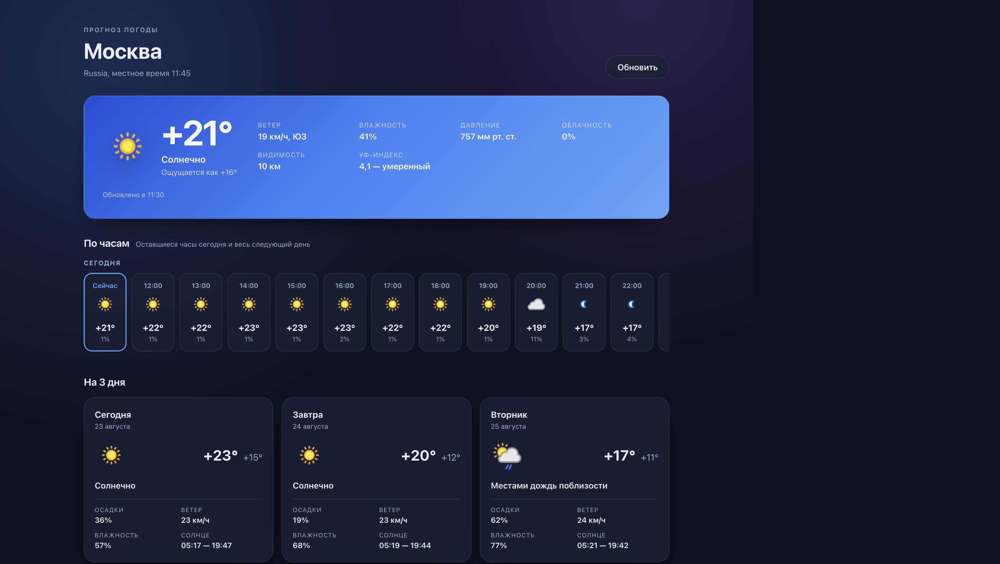
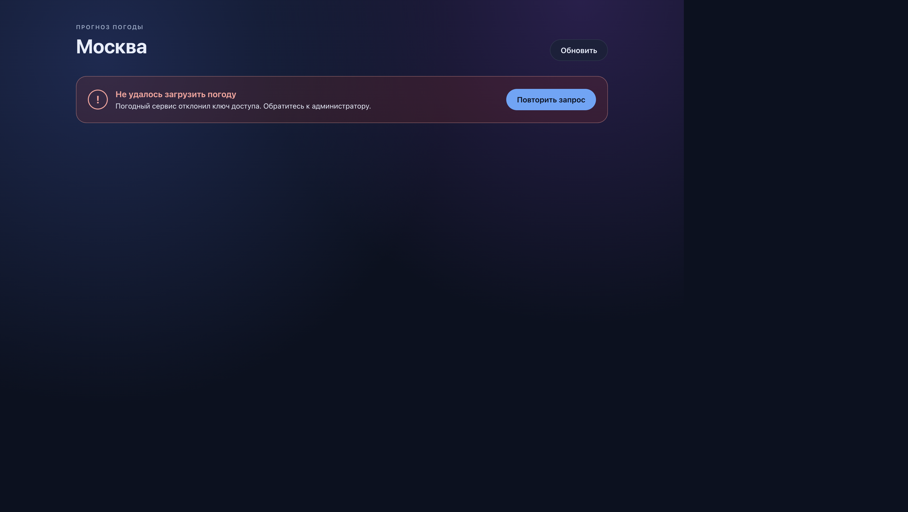
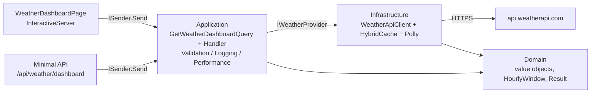

# Погодное приложение (.NET 10 + Blazor + Clean Architecture)

Один экран с погодой для Москвы: текущая, почасовая (оставшиеся часы сегодня и весь следующий день) и прогноз на три дня. Данные — [weatherapi.com](https://www.weatherapi.com/).



Состояние ошибки с повторным запросом:



## Быстрый старт

Ключ из задания уже лежит в `appsettings.json`, поэтому дополнительная настройка не требуется.

```bash
# Docker (рекомендуется)
docker compose up --build
# http://localhost:8080

# Локально
dotnet run --project src/Weather.Web
# http://localhost:5187, Swagger UI (Scalar): http://localhost:5187/scalar/v1
```

Свой ключ можно подставить переменной окружения, не трогая файлы:

```bash
WEATHER_API_KEY=ваш_ключ docker compose up --build
# или локально
Weather__WeatherApi__ApiKey=ваш_ключ dotnet run --project src/Weather.Web
```

Тесты:

```bash
dotnet test                                        # 115 тестов
dotnet test --collect:"XPlat Code Coverage"        # с покрытием
```

## Соответствие заданию

| Требование | Где реализовано |
| --- | --- |
| .NET Core, бекенд + интерфейс | .NET 10, Blazor Web App и Minimal API в одном хосте (`src/Weather.Web`) |
| Фронтенд на Blazor | `Components/Pages/WeatherDashboardPage.razor` + компоненты в `Components/Forecast` |
| Один экран: текущая, почасовая, 3 дня | `CurrentWeatherCard`, `HourlyStrip`, `DailyForecastList` |
| Почасовая: остаток дня + весь следующий | Доменное правило `Domain/Forecasts/HourlyWindow.cs`, считается по локальному времени локации |
| Показ загрузки | `WeatherSkeleton.razor` (skeleton вместо спиннера — меньше «прыжков» вёрстки) |
| Обработка ошибки с кнопкой повтора | `ErrorPanel.razor`, `role="alert"`, кнопка «Повторить запрос» |
| Геолокация зафиксирована на Москве | `Weather:DefaultLocation` в конфигурации, координаты клиентом не принимаются |
| Данные из указанных API | `current.json` и `forecast.json?days=3` вызываются параллельно в `GetWeatherDashboardQueryHandler` |
| .NET 10 | `global.json`, `net10.0` |
| MediatR | CQRS-запрос и три pipeline behavior (валидация, логирование, замер длительности) |
| Clean Architecture | Domain → Application → Infrastructure → Web, направление зависимостей проверяется тестами |
| Тесты | 115 тестов: unit, компонентные (bUnit), интеграционные (WireMock), архитектурные |

## Архитектура



```
src/
  Weather.Domain/          Coordinates, Temperature, прогнозы, HourlyWindow, Result<T> — без внешних зависимостей
  Weather.Application/     запрос, обработчик, порт IWeatherProvider, валидатор, behaviors
  Weather.Infrastructure/  типизированный HTTP-клиент, маппер, кэширующий декоратор, регистрация DI
  Weather.Web/             Blazor-хост, Minimal API, ProblemDetails, Serilog, OpenAPI, /health
tests/
  Weather.Domain.UnitTests/          34 теста: границы почасового окна, value objects, Result
  Weather.Application.UnitTests/     16 тестов: обработчик, валидатор, ValidationBehavior
  Weather.Infrastructure.UnitTests/  27 тестов: разбор реальных ответов API, ошибки, повторы, кэш
  Weather.Web.ComponentTests/        19 тестов bUnit: загрузка, ошибка с повтором, успешный рендер
  Weather.Web.IntegrationTests/      10 тестов: контракт эндпоинта и предварительный рендер страницы
  Weather.ArchitectureTests/          9 тестов: направление зависимостей и соглашения
```

## Ключевые решения

**Один поход UI → один запрос MediatR.** `GetWeatherDashboardQuery` дёргает оба эндпоинта из задания параллельно (`Task.WhenAll`) и собирает единый ответ. `forecast.json` содержит и текущую погоду, поэтому падение `current.json` не оставляет пользователя без экрана — обработчик подставляет данные из прогноза.

**Почасовое окно — доменное правило, а не логика вьюхи.** «Оставшиеся часы сегодня и все часы следующего дня» считаются по локальному времени локации, которое приходит в ответе (`localtime` + `localtime_epoch`), а не по времени сервера. Иначе приложение, развёрнутое в другом часовом поясе, показывало бы неверное окно. Время берётся через `TimeProvider`, поэтому правило полностью покрыто тестами, включая переход через полночь.

**Ошибки — значения, а не исключения.** `Result<T>` с типизированными ошибками (`InvalidApiKey`, `LocationNotFound`, `RateLimited`, `ProviderUnavailable`, `InvalidResponse`). Категория ошибки определяет HTTP-статус в одном месте (`ErrorResults`), поэтому новый код ошибки не требует правок в эндпоинтах. Наружу уходит `ProblemDetails` с полем `errorCode`.

**Устойчивость и экономия лимита.** Типизированный `HttpClient` со `AddStandardResilienceHandler` (повторы, размыкатель цепи, таймауты) и кэширующий декоратор на `HybridCache` с защитой от cache stampede: 5 минут для текущей погоды, 15 минут для прогноза — с той же частотой их обновляет провайдер. Неуспешные ответы не кэшируются, иначе пользователь видел бы ошибку ещё пять минут после починки сервиса.

**Двойной запрос при предварительном рендере.** Blazor рендерит страницу дважды: сначала на сервере, потом при подключении интерактивного канала. Атрибут `[PersistentState]` (новинка .NET 10) переносит уже загруженные данные во второй рендер, поэтому обращение к провайдеру происходит один раз.

**Кодировка ответов.** Кодировщики ASP.NET по умолчанию экранируют всё за пределами ASCII: каждая русская буква превращается в `&#x41C;` в HTML и `\u041C` в JSON. Для русскоязычного приложения это лишние байты в каждом ответе, поэтому в `Program.cs` настроены `HtmlEncoder` и `JavaScriptEncoder` с кириллическим диапазоном.

## Осознанные отклонения от текста задания

| Что | Почему |
| --- | --- |
| HTTPS вместо `http://` в примерах | Ключ доступа нельзя передавать в открытом канале; провайдер поддерживает TLS |
| Параметр `lang=ru` | Провайдер отдаёт локализованные описания погоды, иначе в русском интерфейсе висело бы «Sunny» |
| Координаты не принимаются от клиента | Геолокация зафиксирована заданием; открытый параметр позволил бы гонять чужой платный ключ по всему миру |
| Ключ лежит в `appsettings.json` | Чтобы проверяющий запустил проект одной командой. Значение переопределяется переменной `Weather__WeatherApi__ApiKey`; в проде это Key Vault или секреты оркестратора |

## API

`GET /api/weather/dashboard` — весь экран одним ответом.

```json
{
  "location": { "name": "Москва", "timeZoneId": "Europe/Moscow", "localTime": "2026-08-23T11:45:00+03:00" },
  "current": { "temperatureC": 20.8, "feelsLikeC": 16.4, "condition": { "text": "Солнечно", "iconUrl": "https://cdn.weatherapi.com/..." } },
  "hourly": [ { "time": "2026-08-23T11:00:00+03:00", "temperatureC": 20.8 } ],
  "daily":  [ { "date": "2026-08-23", "minTemperatureC": 15.2, "maxTemperatureC": 23 } ]
}
```

Ошибка приходит как `ProblemDetails`:

```json
{
  "title": "Ошибка доступа к погодному сервису",
  "status": 502,
  "detail": "Погодный сервис отклонил ключ доступа. Обратитесь к администратору.",
  "errorCode": "weather.invalid_api_key"
}
```

| Ситуация | Код |
| --- | --- |
| Успех | 200 |
| Провайдер отклонил ключ | 502 |
| Превышен лимит обращений | 429 |
| Провайдер недоступен | 503 |

Дополнительно: `GET /health` — проверка живости вместе с доступностью провайдера; `/scalar/v1` — интерактивная документация OpenAPI (только в Development).

## Конфигурация

| Ключ | По умолчанию | Назначение |
| --- | --- | --- |
| `Weather:DefaultLocation:Name` | Москва | Заголовок экрана |
| `Weather:DefaultLocation:Latitude/Longitude` | 55.7558 / 37.6173 | Координаты запроса |
| `Weather:WeatherApi:ApiKey` | ключ из задания | Доступ к провайдеру, проверяется на старте |
| `Weather:WeatherApi:BaseAddress` | `https://api.weatherapi.com/v1/` | Адрес провайдера |
| `Weather:WeatherApi:TimeoutSeconds` | 10 | Таймаут одной попытки |
| `Weather:WeatherApi:MaxRetryAttempts` | 2 | Число повторов при временных сбоях |
| `Weather:WeatherApi:CurrentCacheSeconds` | 300 | TTL текущей погоды, 0 отключает кэш |
| `Weather:WeatherApi:ForecastCacheSeconds` | 900 | TTL прогноза |
| `Weather:UseHttpsRedirection` | true | Отключается за обратным прокси (в `docker-compose.yml` уже выключено) |

Любой ключ переопределяется переменной окружения через двойное подчёркивание: `Weather__WeatherApi__ApiKey`.

## Тесты

| Проект | Что проверяет |
| --- | --- |
| `Weather.Domain.UnitTests` | Границы почасового окна (23:00, полночь, конец следующего дня), валидацию координат, инвариантную культуру, `Result<T>` |
| `Weather.Application.UnitTests` | Параллельные вызовы, подмену текущей погоды из прогноза при сбое, валидацию запроса, `ValidationBehavior` |
| `Weather.Infrastructure.UnitTests` | Разбор сохранённых ответов weatherapi.com, маппинг иконок и часового пояса, 401/400/429/500, повторы, кэш и его сериализацию |
| `Weather.Web.ComponentTests` | Skeleton при загрузке, панель ошибки и повторный запрос по кнопке, три карточки дней, форматирование времени и давления |
| `Weather.Web.IntegrationTests` | Контракт `/api/weather/dashboard`, `ProblemDetails`, `/health`, предварительный рендер страницы |
| `Weather.ArchitectureTests` | Domain ни от кого не зависит, Application не знает про HTTP, детали инфраструктуры не торчат наружу |

Инфраструктурные тесты работают против WireMock.Net с **реальными** ответами провайдера, сохранёнными в `tests/Weather.Infrastructure.UnitTests/Fixtures` — так проверяются настоящие форматы дат, protocol-relative иконки и структура ошибок.

## Сборка и CI

GitHub Actions (`.github/workflows/ci.yml`): восстановление, `dotnet format --verify-no-changes`, сборка (предупреждения трактуются как ошибки), все тесты с покрытием и отчётом, затем сборка Docker-образа с проверкой, что контейнер поднимается и отвечает.

Образ многоступенчатый: SDK остаётся в слое сборки, приложение работает не под root, есть `HEALTHCHECK`.

## Заметки

- MediatR с версии 13 распространяется по двойной лицензии и пишет предупреждение об отсутствии коммерческого ключа. Для разработки ключ не нужен, поэтому категория лога заглушена точечно в `Program.cs`.
- Тесты используют xUnit v2: в .NET 10 SDK на момент разработки `dotnet test` не обнаруживал тесты xUnit v3 через Microsoft.Testing.Platform. Причина зафиксирована в комментарии в `Directory.Packages.props`.
- Решения по архитектуре кратко описаны в [docs/adr](docs/adr).
